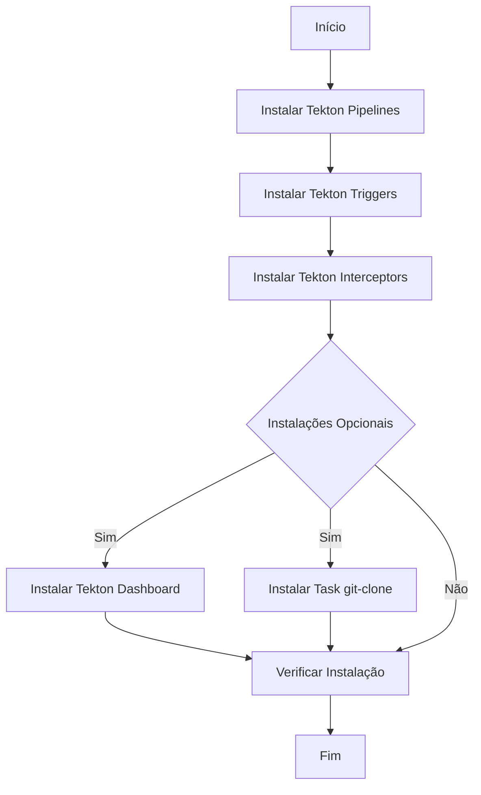

# Instalação do Tekton

Este guia fornece instruções detalhadas para instalar o Tekton em seu cluster Kubernetes.

## Índice

1. [Pré-requisitos](#pré-requisitos)
2. [Visão Geral da Instalação](#visão-geral-da-instalação)
3. [Passos de Instalação](#passos-de-instalação)
4. [Verificação da Instalação](#verificação-da-instalação)
5. [Instalações Opcionais](#instalações-opcionais-recomendadas)
6. [Próximos Passos](#próximos-passos)
7. [Solução de Problemas](#solução-de-problemas)

## Pré-requisitos

Antes de começar, certifique-se de que você tem:

- Um cluster Kubernetes em funcionamento
- `kubectl` instalado e configurado para se comunicar com seu cluster

## Visão Geral da Instalação

O processo de instalação do Tekton inclui os seguintes componentes:



## Passos de Instalação

1. Instale o Tekton Pipelines:

```bash
kubectl apply --filename https://storage.googleapis.com/tekton-releases/pipeline/previous/v0.56.4/release.yaml
```

2. Instale o Tekton Triggers:

```bash
kubectl apply --filename https://storage.googleapis.com/tekton-releases/triggers/previous/v0.26.2/release.yaml
```

3. Instale os Tekton Interceptors:

```bash
kubectl apply --filename https://storage.googleapis.com/tekton-releases/triggers/previous/v0.26.2/interceptors.yaml
```

## Verificação da Instalação

Após a execução dos comandos acima, verifique se a instalação foi bem-sucedida:

```bash
kubectl get pods --namespace tekton-pipelines
```

Você deve ver vários pods em execução no namespace `tekton-pipelines`.

## Instalações Opcionais (Recomendadas)

### Tekton Dashboard

O Tekton Dashboard fornece uma interface web para visualizar e gerenciar seus pipelines Tekton.

Para instalar:

```bash
kubectl apply --filename https://storage.googleapis.com/tekton-releases/dashboard/latest/release.yaml
```

### Task git-clone

A task git-clone é uma tarefa reutilizável que clona um repositório git.

Para instalar:

```bash
kubectl apply -f https://raw.githubusercontent.com/tektoncd/catalog/main/task/git-clone/0.7/git-clone.yaml -n tekton
```

Nota: Este comando instala a task no namespace `tekton`. Ajuste o namespace conforme necessário.

## Próximos Passos

1. Comece a criar e executar Tekton Tasks e Pipelines em seu cluster.
2. Se instalou o Dashboard, acesse-o com:

```bash
kubectl --namespace tekton-pipelines port-forward svc/tekton-dashboard 9097:9097
```

3. Consulte a [documentação oficial do Tekton](https://tekton.dev/docs/) para mais informações.

## Solução de Problemas

Se encontrar problemas durante a instalação:

1. Verifique se todos os pods estão em estado "Running":
   ```bash
   kubectl get pods --namespace tekton-pipelines
   ```

2. Verifique os logs dos pods com problemas:
   ```bash
   kubectl logs <nome-do-pod> --namespace tekton-pipelines
   ```

3. Certifique-se de que seu cluster tem recursos suficientes (CPU, memória) para executar o Tekton.

4. Verifique se há conflitos com outras instalações ou versões anteriores do Tekton.

Para mais assistência, consulte a [comunidade Tekton](https://github.com/tektoncd/community) ou abra uma issue no repositório relevante do Tekton no GitHub.