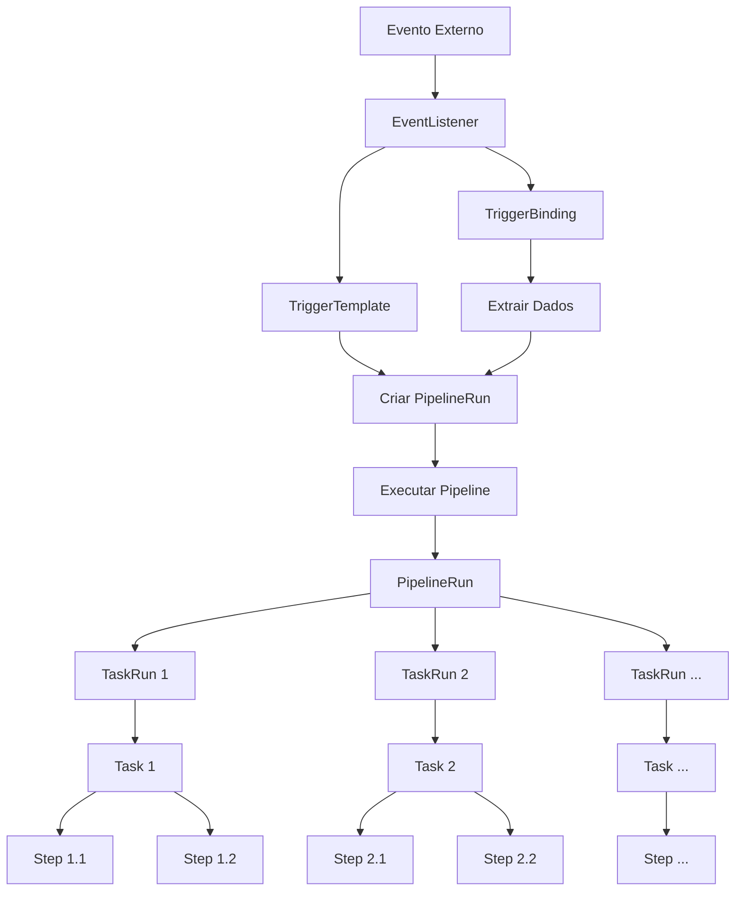
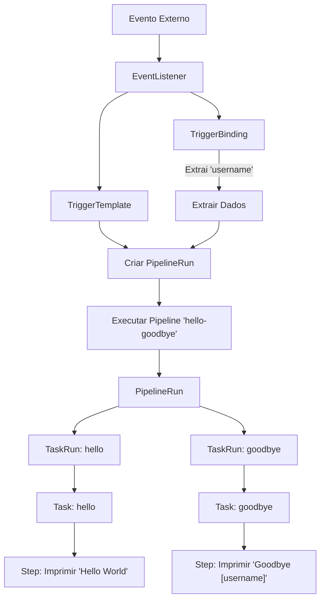

# Começando com Tekton

# Visão Geral

O Tekton é uma estrutura de CI/CD baseada em Kubernetes que permite a criação de pipelines flexíveis e reutilizáveis. Os componentes principais são:

1. EventListener: Escuta eventos externos.
2. TriggerTemplate: Configura um PipelineRun quando um evento ocorre.
3. TriggerBinding: Passa dados para o PipelineRun criado pelo TriggerTemplate.
4. Pipeline: Define uma série de Tasks a serem executadas.
5. PipelineRun: Uma instância de execução de uma Pipeline.
6. Task: Define um conjunto de Steps a serem executados sequencialmente.
7. TaskRun: Uma instância de execução de uma Task.
8. Step: A unidade mais básica de execução, geralmente um comando ou script.

# Passos para Configuração

1. Instalar Tekton Pipelines e Triggers
   - Usar kubectl para instalar os componentes necessários.

2. Criar Pipeline
   - Define a sequência de Tasks a serem executadas.

3. Criar Tasks
   - Define os Steps específicos para cada Task.

4. Criar TriggerTemplate
   - Define o que acontece quando um evento é detectado.
   - Inclui a configuração do PipelineRun.

5. Criar TriggerBinding
   - Extrai informações do evento.
   - Passa dados para o PipelineRun.

6. Criar EventListener
   - Combina TriggerTemplate e TriggerBinding.
   - Requer uma conta de serviço com permissões adequadas.

7. Executar o Trigger
   - Configurar port-forwarding para o EventListener.
   - Enviar um payload para testar o trigger.

8. Monitorar PipelineRuns e TaskRuns
   - Verificar o status e os logs das execuções.

# Passos de Instalação

1. Instale o Tekton Pipelines:

```bash
kubectl apply --filename https://storage.googleapis.com/tekton-releases/pipeline/previous/v0.56.4/release.yaml
```

2. Instale o Tekton Triggers:

```bash
kubectl apply --filename https://storage.googleapis.com/tekton-releases/triggers/previous/v0.26.2/release.yaml
```

3. Instale os Tekton Interceptors:

```bash
kubectl apply --filename https://storage.googleapis.com/tekton-releases/triggers/previous/v0.26.2/interceptors.yaml
```

## Verificação da Instalação

Após a execução dos comandos acima, verifique se a instalação foi bem-sucedida:

```bash
kubectl get pods --namespace tekton-pipelines
```

Você deve ver vários pods em execução no namespace `tekton-pipelines`.

## Instalações Opcionais (Recomendadas)

### Tekton Dashboard

O Tekton Dashboard fornece uma interface web para visualizar e gerenciar seus pipelines Tekton.

Para instalar:

```bash
kubectl apply --filename https://storage.googleapis.com/tekton-releases/dashboard/latest/release.yaml
```

### Task git-clone

A task git-clone é uma tarefa reutilizável que clona um repositório git.

Para instalar:

```bash
kubectl apply -f https://raw.githubusercontent.com/tektoncd/catalog/main/task/git-clone/0.7/git-clone.yaml -n tekton
```

Nota: Este comando instala a task no namespace `tekton`. Ajuste o namespace conforme necessário.

## Próximos Passos

1. Comece a criar e executar Tekton Tasks e Pipelines em seu cluster.
2. Se instalou o Dashboard, acesse-o com:

```bash
kubectl --namespace tekton-pipelines port-forward svc/tekton-dashboard 9097:9097
```

3. Consulte a [documentação oficial do Tekton](https://tekton.dev/docs/) para mais informações.

## Solução de Problemas

Se encontrar problemas durante a instalação:

1. Verifique se todos os pods estão em estado "Running":
   ```bash
   kubectl get pods --namespace tekton-pipelines
   ```

2. Verifique os logs dos pods com problemas:
   ```bash
   kubectl logs <nome-do-pod> --namespace tekton-pipelines
   ```

3. Certifique-se de que seu cluster tem recursos suficientes (CPU, memória) para executar o Tekton.

4. Verifique se há conflitos com outras instalações ou versões anteriores do Tekton.

Para mais assistência, consulte a [comunidade Tekton](https://github.com/tektoncd/community) ou abra uma issue no repositório relevante do Tekton no GitHub.

# Fluxo do Processo

1. Um evento externo é capturado pelo EventListener.
2. O TriggerBinding extrai dados relevantes do evento.
3. O TriggerTemplate usa esses dados para criar um PipelineRun.
4. O PipelineRun inicia a execução da Pipeline definida.
5. A Pipeline executa uma série de Tasks.
6. Cada Task é executada como um TaskRun.
7. Cada TaskRun executa uma série de Steps.
8. O processo é concluído quando todas as Tasks são executadas com sucesso.

## Diagrama



## Exemplo Prático

O guia demonstra como criar um trigger que executa um pipeline "hello-goodbye" quando um evento é detectado. O pipeline recebe um parâmetro "username" e executa duas tarefas:

1. Uma tarefa "hello" que imprime "Hello World".
2. Uma tarefa "goodbye" que imprime "Goodbye [username]!".


