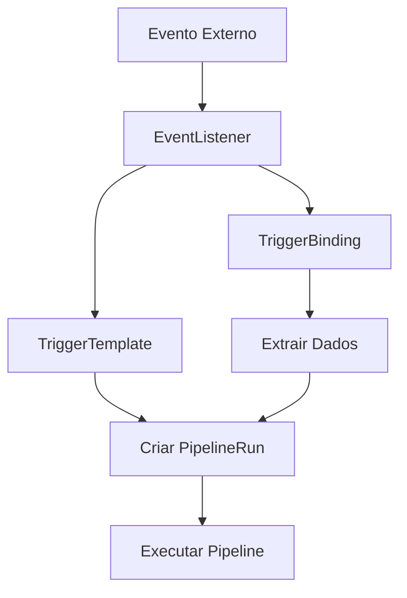

# Começando com Tekton Triggers

## Visão Geral

O Tekton Triggers permite modificar o comportamento dos seus pipelines de CI/CD com base em eventos externos. Os componentes principais são:

1. **EventListener**: Escuta eventos externos.
2. **TriggerTemplate**: Configura um PipelineRun quando um evento ocorre.
3. **TriggerBinding**: Passa dados para o PipelineRun criado pelo TriggerTemplate.

## Passos para Configuração

1. **Instalar Tekton Triggers**
   - Usar `kubectl` para instalar os componentes necessários.

2. **Criar TriggerTemplate**
   - Define o que acontece quando um evento é detectado.
   - Inclui a configuração do PipelineRun.

3. **Criar TriggerBinding**
   - Executa o TriggerTemplate.
   - Extrai informações do evento.

4. **Criar EventListener**
   - Combina TriggerTemplate e TriggerBinding.
   - Requer uma conta de serviço com permissões adequadas.

5. **Executar o Trigger**
   - Configurar port-forwarding para o EventListener.
   - Enviar um payload para testar o trigger.

## Fluxo do Processo

## Exemplo Prático

O guia demonstra como criar um trigger que executa um pipeline "hello-goodbye" quando um evento é detectado. O pipeline recebe um parâmetro "username" e executa duas tarefas:

1. Uma tarefa "hello" que imprime "Hello World".
2. Uma tarefa "goodbye" que imprime "Goodbye [username]!".

## Limpeza

Após a execução, é possível limpar os recursos deletando o cluster Minikube.

## Leitura Adicional

- Clonar um repositório git com Tekton.
- Construir e enviar uma imagem de contêiner com Tekton.
- Mais exemplos no repositório GitHub do Tekton Triggers.